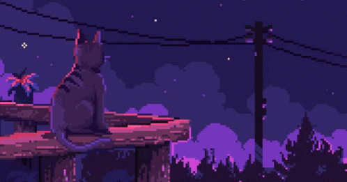

### Hi there! I’m Dani 
### Software Engineering Student | Cat Lover | Dreamer 🌙🐱

  

---

<!-- Presentación dinámica --> 
                   🐾 Fun fact: If you see a cat near the keyboard, that's *Luna* — best debugging partner 😹

---

## 🛠️ Tech Stack

**Languages:**  

**Databases:**  

## 📊 GitHub Stats

  
  

## 📫 Let's Connect

---

      *"The future belongs to those who believe in the beauty of their dreams... and codify them! and codify them!* ✨
